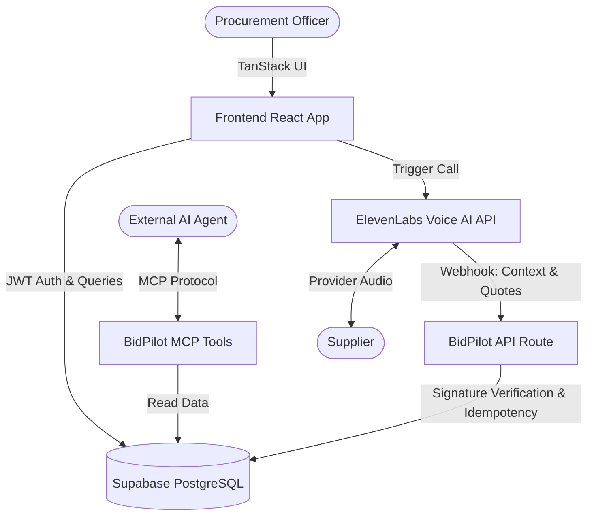

<div align="center">
  
  <h1>BidPilot-AI</h1>
  <p><strong>The Next-Generation AI Procurement & Negotiation Platform.</strong></p>
  <p>Automate negotiations, capture evidence, and finalize quotes autonomously with Voice AI.</p>

  <p align="center">
    
    
    
    
    
  </p>
</div>

<br/>

## 🌟 Overview

**BidPilot-AI** is a cutting-edge platform designed to completely automate and streamline the procurement and negotiation lifecycle. Instead of manually haggling with providers, BidPilot-AI uses advanced **Voice AI (ElevenLabs)** to call providers, negotiate terms based on rigorous intake specifications, and automatically ingest the final quoted line-items into a secure system.

With native **Model Context Protocol (MCP)** integration, your internal AI agents can easily retrieve quotes, oversee negotiations, and audit past calls with zero friction.

---

## ✨ Features & Capabilities

### 🎙️ Voice AI Negotiation (Powered by ElevenLabs)
- **Autonomous Calls**: Initiates and handles provider negotiations in real time using highly optimized ElevenLabs Voice AI.
- **Idempotent Webhooks**: Secure, signature-verified endpoints (`/api/public/elevenlabs/post-call`) handle post-call transcription and state reconciliation flawlessly.
- **Context Injection**: Dynamically loads real-time context and dynamic limits (`load-call-context`) into the AI agent mid-conversation.
- **Quote Extraction**: Custom ElevenLabs tools capture quote line items natively during the call (`save-quote-line-item`, `finalize-call-outcome`).

### 💼 Complete Negotiation Lifecycle
BidPilot-AI tracks every stage of the procurement process via dedicated operational "rooms":
1. **Intake & Specification**: Define boundaries, budget constraints, and strict material requirements.
2. **Providers & Readiness**: Vet and stage suppliers for negotiation.
3. **Control Room & Calls**: Launch real-time calls and monitor Live Voice AI transcripts.
4. **Quotes & Evidence**: Review AI-reconciled quote snapshots and conversational evidence.
5. **Integrity & Report**: Verify final outcomes against initial specifications before generating comprehensive audit reports.

### 🤖 Model Context Protocol (MCP) Integration
Built-in MCP server support exposes BidPilot-AI's core data to external LLM tooling seamlessly:
- `get-negotiation`: Retrieve comprehensive negotiation parameters.
- `list-calls` / `list-quotes` / `list-providers`: Aggregate real-time procurement data.
- `recent-agent-events`: Monitor autonomous agent actions and success/failure rates.

### 🔒 Enterprise-Grade Architecture
- **Supabase Backend**: Complete Row-Level Security (RLS) isolation, PostgreSQL functions, and robust typed interactions.
- **Optimized UI**: Fully responsive Dashboard built with Radix UI primitives and Tailwind CSS.
- **Type-Safe Routing**: File-based routing driven by TanStack Start and TanStack Router for zero-compromise developer experience.

---

## 🏗️ System Architecture



---

## 🛠️ Technology Stack

| Category | Technology | Purpose |
| :--- | :--- | :--- |
| **Frontend Framework** | React 19, TanStack Start | Core App Rendering & Framework |
| **Routing & State** | TanStack Router, TanStack Query | Type-safe Routing & Data Fetching |
| **UI Components** | Tailwind CSS v4, Radix UI, Lucide | Design System & Accessibility |
| **Backend / DB** | Supabase (PostgreSQL) | Auth, Database, RLS, Edge Functions |
| **Voice AI & LLM** | ElevenLabs | Voice Synthesis, Call Webhooks, Tooling |
| **Build & Tooling** | Vite, Bun | High-speed bundler & package management |

---

## 📂 Codebase Geography

```text
BidPilot-AI/
├── src/
│   ├── components/ui/   # Reusable Radix + Tailwind primitives (Buttons, Dialogs, etc.)
│   ├── hooks/           # Custom state hooks (e.g., use-auth, use-mobile)
│   ├── integrations/    # Supabase server/client instances & auth middleware
│   ├── lib/             # Core business logic (Reconciliation, Specs, Rate Limits)
│   ├── lib/mcp/         # Native Model Context Protocol server definitions
│   └── routes/          # TanStack file-based routing directory
│       ├── api/         # Public API (e.g., ElevenLabs post-call webhooks)
│       ├── app/         # Protected dashboard and negotiation lifecycles
│       └── __root.tsx   # Root layout and global providers
├── supabase/
│   ├── migrations/      # Version-controlled PostgreSQL schema definitions
│   └── tests/           # Robust test suite covering RLS and Job Specs
├── public/              # Static assets and icons
└── package.json         # Scripts, dependencies, and configuration
```

---

## 🚀 Getting Started

### Prerequisites
- **[Bun](https://bun.sh/)** v1.x (or Node 22+)
- **[Supabase CLI](https://supabase.com/docs/guides/cli)** (for local database & Edge Functions)
- **ElevenLabs Account** (for Voice AI features)

### 1. Clone the repository
```bash
git clone https://github.com/ZulaidAbbasi/BidPilot-AI.git
cd BidPilot-AI
```

### 2. Install dependencies
```bash
bun install
```

### 3. Environment Configuration
Copy the sample environment file to `.env`:
```bash
cp .env.example .env
```
Populate your `.env` file. You will need your Supabase project credentials and an `ELEVENLABS_WEBHOOK_SECRET` for local/production webhooks.
```env
# Client-visible variables
VITE_SUPABASE_URL=http://127.0.0.1:54321
VITE_SUPABASE_PUBLISHABLE_KEY=your-anon-key
VITE_SUPABASE_PROJECT_ID=your-project-id

# Server-only variables
SUPABASE_URL=http://127.0.0.1:54321
SUPABASE_PUBLISHABLE_KEY=your-anon-key
SUPABASE_SERVICE_ROLE_KEY=your-service-role-key
ELEVENLABS_WEBHOOK_SECRET=your-webhook-secret
```

### 4. Database Setup
Start up the local Supabase container and push migrations:
```bash
supabase start
supabase db push
```

*(Optional)* Run database tests to verify RLS logic:
```bash
supabase test db
```

### 5. Start Development Server
```bash
bun run dev
```
The application runs out-of-the-box on `http://localhost:5173`. 

---

## 🧪 Testing & Code Quality

Maintaining the integrity of the procurement platform is critical. BidPilot-AI includes several scripts for code quality:

- **Type Checking:** `bun run typecheck`
- **Linting:** `bun run lint`
- **Code Formatting:** `bun run format`
- **Unit/Integration Tests:** `bun run test` (Powered by Vitest)
- **Security Scans:** `bun run test:security`

---

## 🤝 Contributing

We welcome contributions, bug reports, and feature requests! 
To contribute:
1. Fork the project.
2. Create your feature branch (`git checkout -b feature/AmazingFeature`).
3. Commit your changes (`git commit -m 'feat: Add some AmazingFeature'`).
4. Push to the branch (`git push origin feature/AmazingFeature`).
5. Open a Pull Request.

---

## 📄 License & Proprietary Notice

This project is **Proprietary and Confidential**. Unauthorized copying, modification, or distribution is strictly prohibited.

---

<div align="center">
  <p>Built with ❤️ for the future of AI procurement.</p>
</div>
