# BidPilot AI

> **Real quotes. Honest leverage. Better deals.**

BidPilot AI is an evidence-first voice negotiation platform for residential moving services. It creates one customer-confirmed moving specification, presents that exact scope consistently to multiple providers, captures comparable itemized quotes, negotiates using verified leverage, and produces a transparent recommendation supported by transcripts, structured evidence, risk analysis, and server-verified outcomes.

<p align="center">
  <a href="https://bidpilot-ai.lovable.app/"><strong>Live Application</strong></a> ·
  <a href="https://github.com/ZulaidAbbasi/BidPilot-AI"><strong>GitHub Repository</strong></a> ·
  <a href="https://www.linkedin.com/in/zulaid/"><strong>Creator</strong></a>
</p>

<p align="center">
  
  
  
  
  
  
</p>

---

## Contents

- [Overview](#overview)
- [Challenge](#challenge)
- [Problem](#problem)
- [Solution](#solution)
- [Core Principles](#core-principles)
- [End-to-End Workflow](#end-to-end-workflow)
- [System Architecture](#system-architecture)
- [Canonical Specification](#canonical-specification)
- [Customer Intake](#customer-intake)
- [ElevenLabs Voice Agents](#elevenlabs-voice-agents)
- [Provider Workflow](#provider-workflow)
- [Quote Lifecycle](#quote-lifecycle)
- [Verified Leverage](#verified-leverage)
- [Evidence Reconciliation](#evidence-reconciliation)
- [Ranking and Risk](#ranking-and-risk)
- [User Experience](#user-experience)
- [Data Architecture](#data-architecture)
- [API and Tool Contracts](#api-and-tool-contracts)
- [Security](#security)
- [Technology Stack](#technology-stack)
- [Repository Structure](#repository-structure)
- [Local Development](#local-development)
- [Environment Variables](#environment-variables)
- [Testing](#testing)
- [Deployment](#deployment)
- [Hackathon Demo](#hackathon-demo)
- [Challenge Compliance](#challenge-compliance)
- [Current Verification Status](#current-verification-status)
- [Roadmap](#roadmap)
- [Creator](#creator)

---

## Overview

Moving quotes are notoriously difficult to compare.

One company may quote a flat total. Another may provide only a base price. Another may exclude stairs, long carry, fuel, packing materials, deposits, taxes, parking, shuttle service, valuation coverage, or cancellation charges.

BidPilot solves this by treating voice negotiation as an evidence and systems problem—not merely a conversation problem.

The platform combines:

- structured manual intake,
- AI-assisted document extraction,
- ElevenLabs customer voice intake,
- one canonical moving specification,
- explicit customer confirmation,
- immutable specification versions,
- SHA-256 specification hashing,
- provider quote-gathering calls,
- honest leverage-driven negotiation,
- structured quote stages,
- transcript and recording persistence,
- server-side evidence reconciliation,
- low-outlier risk detection,
- customer-priority-aware ranking,
- and judge-ready reporting.

BidPilot does not consider a fluent conversation sufficient proof.

Every important claim should trace back to persisted evidence.

---

## Challenge

BidPilot was built for:

- **Hack-Nation 6th Global AI Hackathon**
- **Challenge 1: The Negotiator**
- **Sponsor: ElevenLabs**
- **Primary vertical:** United States residential moving services

The challenge requires a voice-agent system that can:

1. understand a customer's requirements,
2. create one confirmed specification,
3. call multiple providers,
4. capture comparable offers,
5. handle difficult provider behavior,
6. use real gathered leverage,
7. obtain a measurable price or material-term improvement,
8. and recommend the strongest evidence-backed deal.

BidPilot's implementation is organized around that complete loop.

---

## Problem

A moving customer usually has to:

- repeat the same requirements to several companies,
- interpret different quote structures,
- remember which fees were included,
- identify suspiciously low offers,
- understand binding versus non-binding estimates,
- track deposits and cancellation conditions,
- negotiate without reliable comparable evidence,
- and make a high-risk decision with little auditability.

Typical failure modes include:

- different inventory being quoted by different providers,
- access conditions being omitted,
- a base rate being presented as an all-in quote,
- hidden fees appearing late,
- competing offers being used despite different scopes,
- provider claims being saved without transcript support,
- and "savings" being calculated from unsupported values.

---

## Solution

BidPilot closes the full procurement and negotiation loop.

### One confirmed scope

Manual intake, document extraction, and voice intake all update the same canonical specification draft.

### Explicit confirmation

The customer reviews the specification and performs a separate **Confirm & Lock** action.

### Version and hash integrity

Each confirmed specification receives:

- an immutable version,
- deterministic canonical JSON,
- and a SHA-256 hash.

### Consistent provider calls

Every provider call is bound to the same confirmed version and hash.

### Structured quote capture

BidPilot captures:

- initial offers,
- revised offers,
- final offers,
- ranges,
- estimate type,
- fees,
- deposits,
- cancellation terms,
- inclusions,
- exclusions,
- and price-change conditions.

### Honest negotiation

Competing quotes may be used only after passing strict server-side eligibility checks.

### Evidence-backed recommendation

Final ranking considers price, certainty, scope, deposits, cancellation, evidence quality, suspicious outliers, unresolved risks, and the customer's structured priorities.

---

## Core Principles

1. One confirmed job
2. One comparable scope
3. Real provider responses
4. No invented bids
5. No invented inventory
6. No silent scope changes
7. No provider-role leakage
8. Verified leverage only
9. No unsupported savings
10. No automatic trust in the lowest price
11. No unauthorized booking or payment
12. No recommendation without sufficient evidence

> When BidPilot cannot verify a fact, it does not use that fact as verified evidence.

---

## End-to-End Workflow

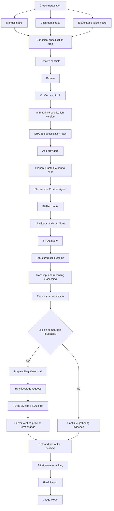

---

## System Architecture

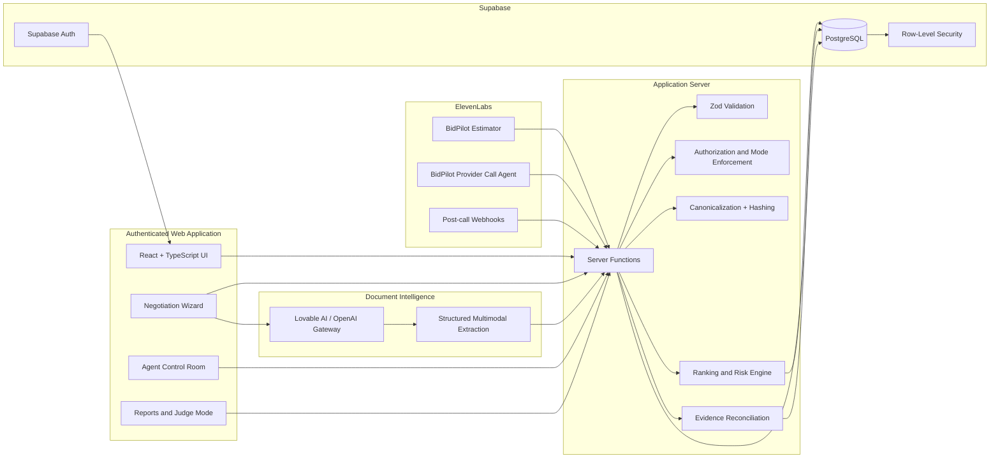

---

## Canonical Specification

The canonical specification is the foundation of the entire platform.

It is shared by:

- manual intake,
- document intake,
- voice intake,
- Review,
- Confirm & Lock,
- provider calls,
- leverage eligibility,
- ranking,
- evidence,
- and final reporting.

### Representative structure

```json
{
  "origin": {
    "line1": "1200 Brickell Avenue",
    "line2": null,
    "city": "Miami",
    "region": "Florida",
    "postal_code": "33131",
    "country": "US"
  },
  "destination": {
    "line1": "100 East Las Olas Boulevard",
    "line2": null,
    "city": "Fort Lauderdale",
    "region": "Florida",
    "postal_code": "33301",
    "country": "US"
  },
  "move_date": "2026-08-22",
  "preferred_time_window": "flexible",
  "bedroom_count": 1,
  "origin_access": {
    "floor": 4,
    "stairs_flights": 0,
    "elevator": "service",
    "elevator_reservation_required": true,
    "long_carry_meters": 15,
    "parking": "loading_dock",
    "parking_permit_required": false
  },
  "destination_access": {
    "floor": 2,
    "stairs_flights": 1,
    "elevator": "none",
    "elevator_reservation_required": false,
    "long_carry_meters": 9,
    "parking": "street",
    "parking_permit_required": false
  },
  "inventory": [],
  "fragile_items": [],
  "specialty_items": [],
  "packing_level": "partial",
  "unpacking_requested": false,
  "disassembly_required": true,
  "reassembly_required": true,
  "storage": {
    "needed": false,
    "climate_controlled": false
  },
  "additional_stops": [],
  "insurance_level": "basic",
  "customer_priorities": [
    "lowest_all_in_price",
    "estimate_certainty",
    "lower_deposit_risk"
  ],
  "agent_permissions": {
    "may_request_quote": true,
    "may_request_itemization": true,
    "may_negotiate_price": true,
    "may_request_fee_waivers": true,
    "may_request_improved_terms": true,
    "may_use_verified_leverage": true,
    "may_request_written_estimates": true,
    "may_accept_offer": false,
    "may_pay_deposit": false,
    "may_change_inventory": false,
    "may_add_paid_services": false,
    "may_reveal_max_budget": false,
    "may_sign_or_authorize": false
  },
  "special_instructions": ""
}
```

### Integrity model

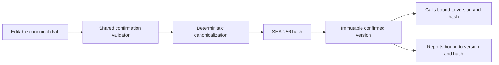

### Safe defaults

BidPilot preserves valid falsy values.

Examples:

- zero stairs is valid,
- zero long-carry distance is valid,
- no elevator is valid,
- no parking permit is valid,
- no storage is valid,
- no unpacking is valid,
- prohibited permissions are explicit `false`.

The system must not confuse `false` or `0` with missing data.

---

## Customer Intake

### Manual wizard

The six-step wizard covers:

1. Move basics
2. Access conditions
3. Inventory
4. Services
5. Priorities and authority
6. Review

**Wizard guarantees:**

- autosave,
- explicit saving and error states,
- origin/destination isolation,
- controlled boolean fields,
- deterministic numeric normalization,
- structured priorities,
- structured permissions,
- complete inventory,
- additional stops,
- shared Review/Confirm validation,
- exact missing-field navigation,
- and explicit confirmation.

### Document intake

Supported document formats may include:

- PDF,
- PNG,
- JPEG,
- WebP,
- GIF,
- CSV,
- and plain text.

Document intake performs:

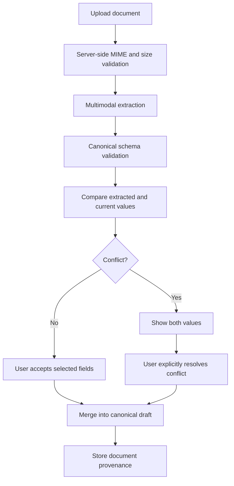

Document extraction never confirms the specification automatically.

### Voice intake

The customer-facing ElevenLabs Estimator:

- loads the existing canonical draft,
- asks one question at a time,
- saves only customer-confirmed values,
- records voice provenance,
- surfaces conflicts,
- avoids guessing,
- and finalizes the intake session without locking the specification.

The application—not the voice agent—performs **Confirm & Lock**.

---

## ElevenLabs Voice Agents

BidPilot uses two separate agents.

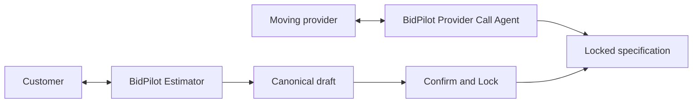

### Agent A — BidPilot Estimator

**Audience:** customer

**Purpose:** gather and confirm moving requirements.

**Tools:**

- `load_intake_context`
- `save_intake_patch`
- `finalize_intake_session`
- ElevenLabs End Conversation

The Estimator must not:

- provide a moving quote,
- call providers,
- confirm the final specification,
- invent unknown information,
- or silently overwrite document/manual data.

### Agent B — BidPilot Provider Call Agent

**Audience:** moving provider

**Purpose:** gather quotes and negotiate.

**Tools:**

- `load_call_context`
- `save_quote_snapshot`
- `save_quote_line_item`
- `finalize_call_outcome`

The Provider Agent must:

- disclose that it is an AI assistant,
- identify whom it represents,
- load server-verified context,
- follow the authoritative call mode,
- use the locked specification,
- ask the provider to supply its own prices,
- capture structured evidence,
- and conclude with one truthful outcome.

It must never receive:

- a provider role card,
- private concession boundaries,
- a hidden-fee strategy,
- a minimum acceptable price,
- predetermined dialogue,
- or rehearsal-style guidance.

---

## Provider Workflow

### Add Provider and prepare call

The Add Provider modal supports:

- Add provider only
- Gather an initial quote
- Negotiate an existing quote

`call_mode` belongs to the call—not the provider.

### Quote Gathering

Default provider action:

- `call_mode = QUOTE_GATHERING`
- `leverage_quote_id = null`

The system prepares the call but does not start ElevenLabs automatically.

A separate explicit **Start voice call** action is required.

### Negotiation

Negotiation remains disabled until verified comparable leverage exists.

- `call_mode = NEGOTIATION`
- `leverage_quote_id = <eligible persisted quote>`

The browser cannot override server-side mode or eligibility enforcement.

### Provider preparation flow

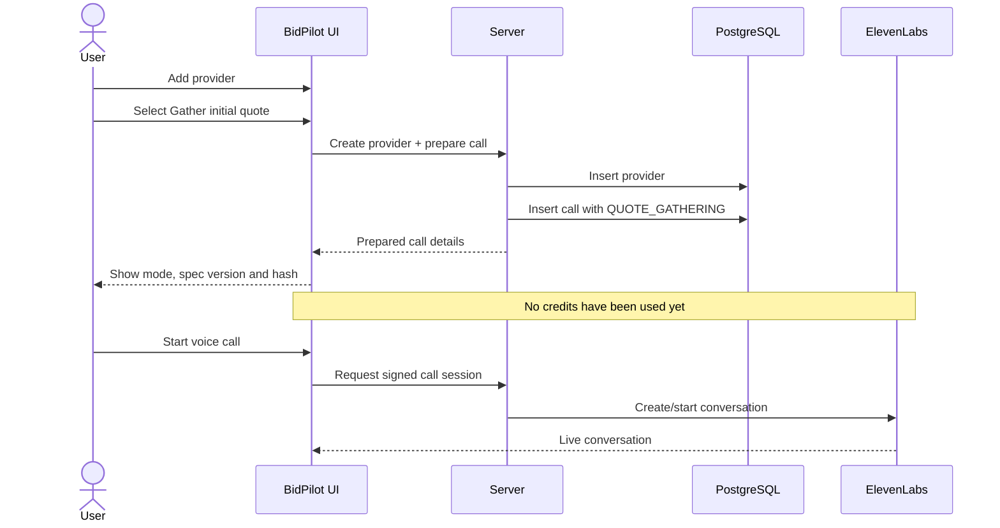

---

## Quote Lifecycle

BidPilot preserves the evolution of each provider offer.

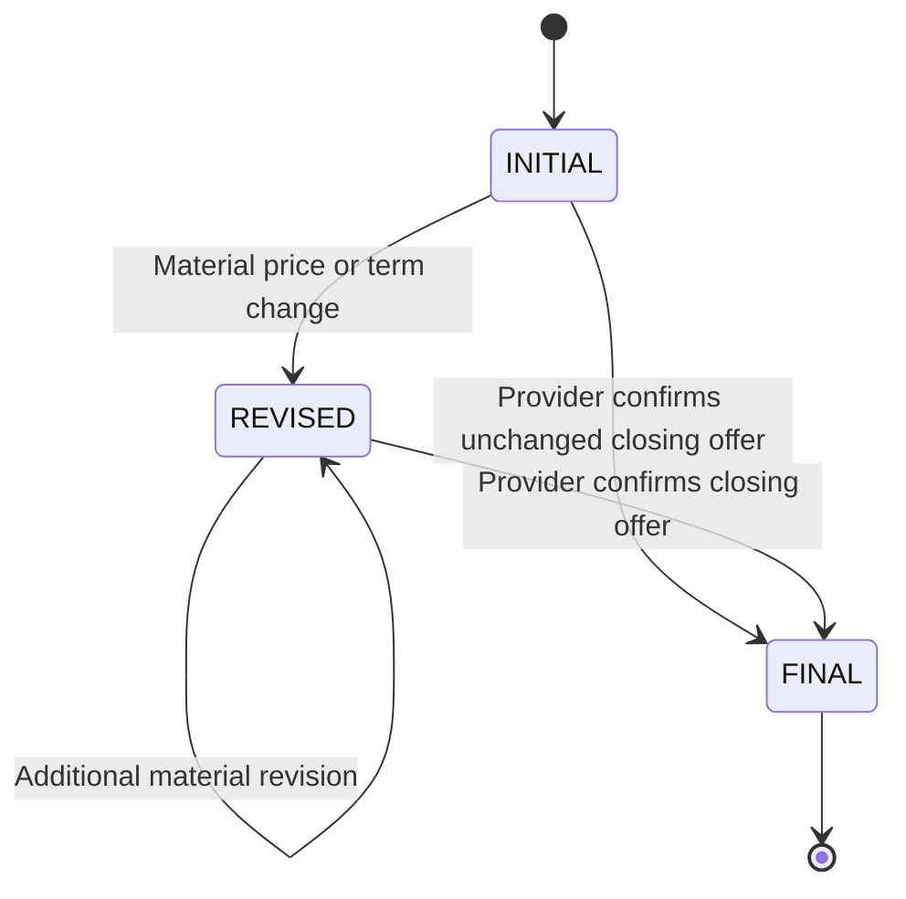

### INITIAL

The first coherent provider offer.

Examples:

- exact total,
- bounded range,
- hourly model with minimum,
- flat base amount with explicit exclusions.

### REVISED

Created only when a material change occurs.

Examples:

- lower total,
- waived fee,
- reduced deposit,
- refundable deposit,
- improved cancellation,
- included materials,
- binding or not-to-exceed commitment.

### FINAL

Created only after the provider explicitly confirms the closing offer.

A call ending does not automatically make the latest quote FINAL.

---

## Verified Leverage

BidPilot does not allow the model to invent or choose arbitrary leverage.

A quote may become leverage only when it passes the shared eligibility engine.

### Eligibility requirements

A leverage quote must:

- belong to the same negotiation,
- use the same confirmed specification hash,
- come from a different provider,
- be a FINAL quote,
- have final confirmation,
- contain supported transcript evidence,
- come from a completed source call,
- come from a reconciled source call,
- have `needs_review = false`,
- not be flagged,
- not be contradictory,
- not be expired,
- contain a usable amount or supported material term,
- and use a compatible currency.

### Negotiation sequence

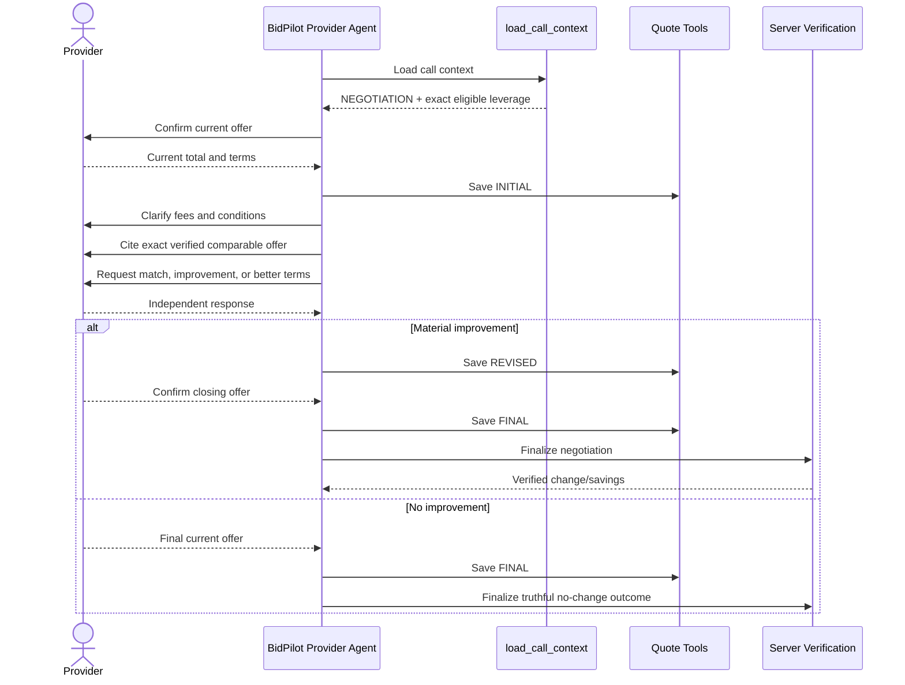

### No bluffing

The agent may never:

- invent a competitor,
- alter a competitor's amount,
- round a quote into a stronger claim,
- use the same provider as its own competitor,
- use different-specification leverage,
- name the competitor without authority,
- reveal the customer's maximum budget,
- or claim savings before server verification.

---

## Evidence Reconciliation

BidPilot separates provider speech from verified facts.

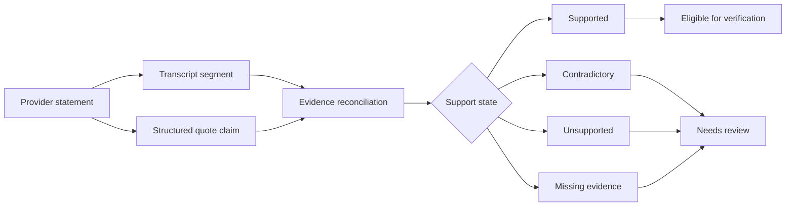

### Evidence states

- `supported`
- `contradictory`
- `unsupported`
- `missing_evidence`

### Evidence can affect

- quote verification,
- leverage eligibility,
- price-change verification,
- term-change verification,
- savings,
- ranking,
- and recommendation.

A repeated number is not automatically verified.

A fluent conversation is not automatically verified.

---

## Ranking and Risk

BidPilot's final recommendation is server-derived.

### Inputs

- supported all-in price,
- supported range,
- estimate type,
- binding certainty,
- scope completeness,
- deposit amount,
- deposit refundability,
- cancellation quality,
- evidence quality,
- unresolved conditions,
- quote expiry,
- provider role,
- and customer priorities.

### Customer priorities

Supported structured priorities:

- `lowest_all_in_price`
- `estimate_certainty`
- `scope_completeness`
- `lower_deposit_risk`
- `better_cancellation`
- `evidence_quality`

Priority order is preserved and converted into server-computed weights.

Preferences can influence ranking but cannot bypass:

- hard eligibility,
- evidence requirements,
- different-specification rejection,
- leverage rules,
- or low-outlier exclusion.

### Low-outlier warning

A supported final quote that is at least 30% below other comparable verified offers is treated as a warning.

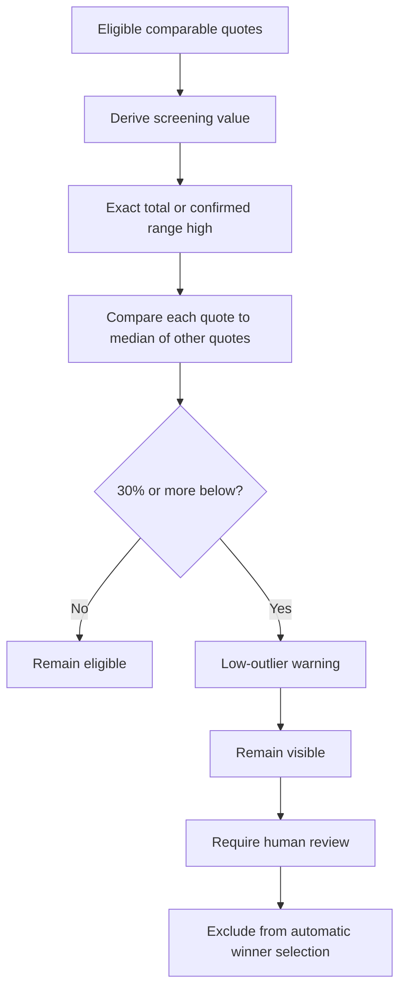

BidPilot does not label the provider fraudulent.

The warning may indicate:

- omitted scope,
- conditional charges,
- estimate uncertainty,
- hidden mandatory fees,
- or incomplete evidence.

---

## User Experience

### Negotiation workspace

Each negotiation includes operational tabs for:

- Overview
- Intake
- Voice Intake
- Specification
- Providers
- Calls
- Control Room
- Quotes
- Evidence
- Integrity
- Final Report
- Readiness / Judge Mode

### Agent Control Room

The Control Room displays:

- provider identity,
- call status,
- call mode,
- timer,
- specification version and hash,
- context-loaded status,
- live transcript,
- tool activity,
- quote progress,
- evidence support,
- risks,
- and final outcome.

### Judge Mode

Judge Mode presents a concise proof chain:

- confirmed specification,
- provider outcomes,
- quote stages,
- itemization,
- transcript support,
- verified leverage,
- price or term movement,
- low-outlier warnings,
- customer priorities,
- and final recommendation.

---

## Data Architecture

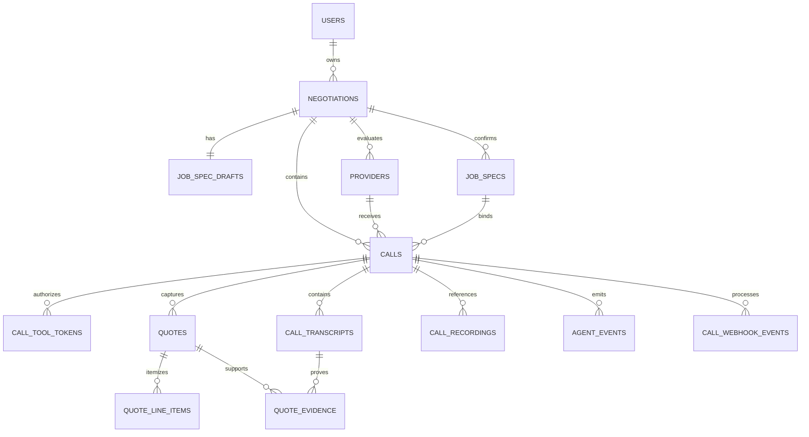

### Core entities

**negotiations** — Stores the user-owned procurement workflow.

**job_spec_drafts** — Stores the editable canonical specification, provenance, conflicts, and draft revision.

**job_specs** — Stores immutable confirmed versions and specification hashes.

**providers** — Stores provider identity and contact information.

**calls** — Stores:

- provider,
- mode,
- status,
- specification version/hash,
- leverage quote,
- conversation ID,
- final outcome,
- verified changes,
- verified savings,
- review state,
- and reconciliation state.

**call_tool_tokens** — Stores hashed, expiring, single-call tool tokens.

**quotes** — Stores staged quote snapshots.

**quote_line_items** — Stores itemized prices, inclusions, exclusions, discounts, and conditions.

**call_transcripts** — Stores ordered speaker segments and timestamps.

**call_recordings** — Stores protected recording references.

**quote_evidence** — Links structured claims to transcript evidence.

**agent_events** — Provides an observable operational timeline.

**call_webhook_events** — Provides idempotent post-call webhook processing.

---

## API and Tool Contracts

### Intake tools

| Tool | Purpose |
|------|---------|
| `load_intake_context` | Load canonical draft, missing fields, revision and conflicts |
| `save_intake_patch` | Persist customer-confirmed fields with provenance |
| `finalize_intake_session` | Finalize voice intake without confirming the spec |

### Provider tools

| Tool | Purpose |
|------|---------|
| `load_call_context` | Load authoritative mode, provider, locked scope, permissions and leverage |
| `save_quote_snapshot` | Save INITIAL, REVISED or FINAL quote |
| `save_quote_line_item` | Save a fee, inclusion, exclusion, discount or condition |
| `finalize_call_outcome` | Save the truthful structured outcome and trigger verification |

### Representative endpoints

```
POST /api/public/elevenlabs/tools/load-call-context
POST /api/public/elevenlabs/tools/save-quote-snapshot
POST /api/public/elevenlabs/tools/save-quote-line-item
POST /api/public/elevenlabs/tools/finalize-call-outcome
POST /api/public/elevenlabs/post-call
```

### Tool authentication

```
X-BidPilot-Call-Token: {{secret__call_tool_token}}
```

The raw token must never be:

- persisted,
- logged,
- shown in the UI,
- included in transcripts,
- added to prompts,
- or exposed to browser JavaScript beyond the intended secure session boundary.

---

## Security

### Security architecture

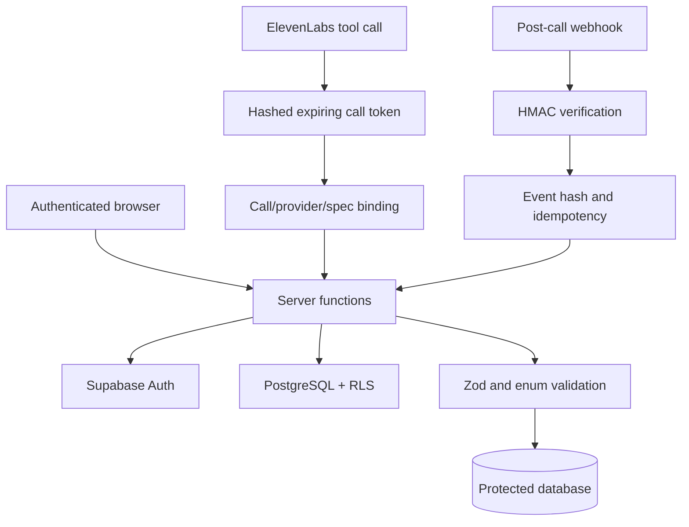

### Implemented safeguards

- Supabase authentication
- Row-Level Security
- server-derived ownership
- immutable confirmed specifications
- deterministic SHA-256 hashing
- stale version/hash rejection
- hashed tool tokens
- token expiry
- strict call binding
- provider binding
- specification binding
- token rotation on retried starts
- old-token invalidation
- timing-safe comparisons
- HMAC webhook verification
- event-hash idempotency
- replay protection
- rate limiting
- input validation
- idempotency keys
- server-side leverage enforcement
- server-side savings verification
- server-side low-outlier calculation
- protected recording references

### Secret policy

Never commit:

- `.env`
- Supabase service-role keys
- ElevenLabs API keys
- webhook secrets
- OpenAI API keys
- raw call-tool tokens
- demo credentials

Commit only `.env.example` containing variable names without secret values.

---

## Technology Stack

### Frontend

- React
- TypeScript
- TanStack Router
- TanStack Query
- React Hook Form
- Zod
- shadcn/ui
- Radix UI primitives
- responsive operational interface

### Backend and data

- Supabase Auth
- PostgreSQL
- Row-Level Security
- server functions
- service-role protected operations
- JSONB canonical specifications
- SHA-256
- HMAC-SHA256
- database-backed rate limiting

### Voice and AI

- ElevenLabs Agents
- ElevenLabs React SDK
- ElevenLabs tool webhooks
- ElevenLabs post-call processing
- Lovable AI Gateway
- OpenAI-compatible multimodal extraction

### Development

- Lovable
- Bun
- Vite/Nitro-compatible application runtime
- Vitest
- TypeScript strict checking
- Playwright-compatible browser testing

---

## Repository Structure

```
BidPilot-AI/
├── src/
│   ├── components/
│   │   ├── app/
│   │   │   ├── control-room/
│   │   │   ├── negotiation/
│   │   │   ├── quotes/
│   │   │   └── reports/
│   │   └── ui/
│   ├── hooks/
│   ├── integrations/
│   ├── lib/
│   │   ├── agent-directives.ts
│   │   ├── call-token.server.ts
│   │   ├── evidence/
│   │   ├── job-spec.ts
│   │   ├── job-spec.functions.ts
│   │   ├── low-outlier.server.ts
│   │   ├── ranking.server.ts
│   │   ├── report.functions.ts
│   │   └── reconciliation/
│   ├── routes/
│   │   ├── api/
│   │   │   └── public/
│   │   │       └── elevenlabs/
│   │   │           ├── tools/
│   │   │           └── post-call.ts
│   │   ├── app.negotiations.new.tsx
│   │   ├── app.negotiations.$id.specification.tsx
│   │   ├── app.negotiations.$id.report.tsx
│   │   └── app.judge-mode.tsx
│   ├── router.tsx
│   ├── routeTree.gen.ts
│   ├── server.ts
│   ├── start.ts
│   └── styles.css
├── supabase/
│   └── migrations/
├── scripts/
│   └── security-tests.ts
├── docs/
│   └── elevenlabs-agent-config.md
├── .env.example
├── AGENTS.md
├── package.json
├── bun.lock
├── tsconfig.json
└── README.md
```

The exact source tree should be generated from the latest repository before release.

---

## Local Development

### Prerequisites

- Bun
- Supabase project
- ElevenLabs account
- Lovable project or compatible runtime
- OpenAI or Lovable AI Gateway access

### Install

```bash
bun install
```

### List available scripts

```bash
bun run
```

### Start development server

```bash
bun run dev
```

### Typecheck

```bash
bun run typecheck
```

### Lint

```bash
bun run lint
```

### Unit tests

```bash
bun run test
```

### Production build

```bash
bun run build
```

### Security tests

```bash
bun run test:security
```

> Security tests require configured live Supabase credentials and should not be reported as passed when those credentials are unavailable.

---

## Environment Variables

Use `.env.example` as the authoritative list.

### Supabase

```
SUPABASE_URL=
SUPABASE_ANON_KEY=
SUPABASE_SERVICE_ROLE_KEY=
```

### ElevenLabs

```
ELEVENLABS_API_KEY=
ELEVENLABS_PROVIDER_AGENT_ID=
ELEVENLABS_ESTIMATOR_AGENT_ID=
ELEVENLABS_WEBHOOK_SECRET=
```

### AI extraction

```
OPENAI_API_KEY=
```

or the configured Lovable AI Gateway variables.

### Application

```
APP_URL=
NODE_ENV=
```

Client-visible variables should use only the prefixes required by the actual runtime.

> Never expose server secrets through client-prefixed environment variables.

---

## Testing

### Latest reported automated baseline

The latest full wizard-repair report in the development environment stated:

- **212 tests passed**
- **30 test files passed**
- **TypeScript typecheck:** clean
- **Production build:** handled by the Lovable build harness
- **Live database security tests:** not executed in that sandbox

The final safe-zero and Add Provider workflow patches were applied afterward. Rerun the complete suite before publishing a final test total.

### Test coverage areas

- canonical specification defaults
- boolean and zero-value persistence
- shared Review/Confirm validation
- deterministic hashing
- immutable confirmed versions
- manual intake
- document intake
- voice intake
- provenance and conflicts
- additional stops
- structured priorities
- structured authority
- priority-based winner changes
- Quote Gathering directives
- Negotiation directives
- AI disclosure
- role-card isolation
- call-mode persistence
- leverage eligibility
- same-provider rejection
- different-spec rejection
- quote final confirmation
- low-outlier detection
- range-high comparison
- token rotation
- old-token rejection
- webhook verification
- evidence reconciliation
- readiness gates
- Final Report
- Judge Mode
- showcase invariants

### Release gate

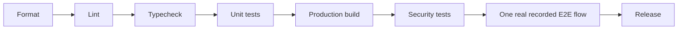

---

## Deployment

**Live application:** https://bidpilot-ai.lovable.app/

### Deployment checklist

- [ ] Latest Lovable build published
- [ ] Latest migrations applied
- [ ] RLS enabled on every user-data table
- [ ] Supabase production secrets configured
- [ ] ElevenLabs Estimator agent published
- [ ] ElevenLabs Provider Agent published
- [ ] Correct tools attached to each agent
- [ ] Dynamic token variables configured
- [ ] Post-call webhook configured
- [ ] `.env` excluded from source control
- [ ] Typecheck passes
- [ ] Lint passes
- [ ] Unit suite passes
- [ ] Production build passes
- [ ] Live security suite passes
- [ ] Real recorded end-to-end workflow passes

---

## Hackathon Demo

The strongest demo uses one fresh negotiation.

### Recommended sequence

1. Create the move.
2. Upload a moving-requirements document.
3. Accept document-derived fields.
4. Complete a short Estimator voice session.
5. Show that voice and document data update the same draft.
6. Review the complete specification.
7. Confirm and Lock.
8. Show specification version and hash.
9. Add three providers.
10. Complete three distinct Quote Gathering calls.
11. Verify transcripts and structured quotes.
12. Select eligible leverage.
13. Run a real Negotiation call.
14. Show INITIAL → REVISED → FINAL.
15. Show server-verified savings or a material-term improvement.
16. Show evidence and low-outlier analysis.
17. Show the ranked Final Report.
18. Finish in Judge Mode.

### Three provider styles

Use private behavioral role cards for human counterparts:

- flexible and transparent,
- hidden-fee / low-headline-price,
- stonewaller / survey or callback.

These are **not scripts**.

The BidPilot agent must never receive these role cards.

---

## Challenge Compliance

| Requirement | BidPilot implementation |
|-------------|------------------------|
| Customer voice intake | Separate ElevenLabs Estimator |
| Document intake | Multimodal canonical extraction |
| Same structured specification | Shared canonical draft |
| Customer confirmation | Explicit Confirm & Lock |
| Verbatim scope reuse | Version/hash-bound calls |
| Three provider styles | Live role-based counterpart behavior |
| Itemized comparable quotes | Snapshots and line items |
| Honest AI disclosure | Provider-agent directive |
| Interruption and friction | Friction protocol |
| Structured outcomes | Final outcome enum |
| Verified leverage | Shared server eligibility engine |
| Price or term movement | INITIAL/REVISED/FINAL lifecycle |
| Transcript evidence | Call transcripts and quote evidence |
| Recording reference | Protected call-recording record |
| Suspicious low-price warning | Server-side 30% low-outlier rule |
| Ranked recommendation | Priority-aware report engine |
| No screenplay | Provider strategy isolated from BidPilot |
| No bluffing | Exact persisted leverage only |

---

## Current Verification Status

### Engineering

- ✅ canonical specification implemented,
- ✅ structured priorities implemented,
- ✅ structured authority implemented,
- ✅ additional stops implemented,
- ✅ shared Review/Confirm validation implemented,
- ✅ deterministic hashing implemented,
- ✅ immutable confirmed specifications implemented,
- ✅ Quote Gathering and Negotiation separated,
- ✅ provider-role leakage removed,
- ✅ real persisted call mode returned,
- ✅ verified leverage context implemented,
- ✅ low-outlier detection implemented,
- ✅ evidence-derived readiness implemented,
- ✅ priority-aware ranking implemented,
- ✅ token rotation implemented,
- ✅ provider next-action workflow implemented.

### Still requiring final live proof

- ⬜ customer voice field persistence on the final production build,
- ⬜ three complete live provider calls,
- ⬜ transcript and recording persistence for all calls,
- ⬜ one eligible leverage negotiation,
- ⬜ one real price or material-term improvement,
- ⬜ server-verified savings,
- ⬜ fully populated Final Report,
- ⬜ and Judge Mode evidence.

> Do not claim complete challenge success until these items have persisted evidence.

---

## Roadmap

### Immediate release gates

- run the latest full automated suite,
- execute live Supabase security tests,
- complete the recorded official showcase,
- verify transcript evidence,
- verify recording references,
- confirm low-outlier behavior,
- finalize README screenshots,
- publish the final GitHub release.

### Product expansion

- real outbound telephony through SIP/Twilio,
- provider discovery,
- parallel quote collection,
- callback scheduling,
- written-estimate ingestion,
- provider licensing verification,
- quote expiry monitoring,
- customer approval workflow,
- human handoff,
- negotiation replay,
- golden-call evaluation datasets,
- and additional procurement verticals.

### Future verticals

The same evidence-first negotiation engine can support:

- auto repair,
- contractor bids,
- commercial cleaning,
- logistics and freight,
- storage,
- equipment rental,
- event vendors,
- and other high-friction service markets.

---

## Creator

**Zulaid Ahmad Abbasi**
Creator and developer of BidPilot AI

- **Live application:** https://bidpilot-ai.lovable.app/
- **GitHub:** https://github.com/ZulaidAbbasi/BidPilot-AI
- **LinkedIn:** https://www.linkedin.com/in/zulaid/

---

## Acknowledgements

Built for the **Hack-Nation Global AI Hackathon** and the **ElevenLabs The Negotiator** challenge.

BidPilot demonstrates that a voice agent can do more than speak convincingly. It can preserve scope integrity, gather evidence, negotiate without bluffing, expose hidden risk, and make its recommendation auditable.

---

## License

No open-source license is currently declared.

Unless a LICENSE file is added, the source code should be treated as **all rights reserved**.